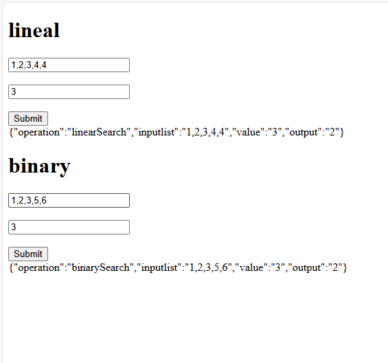

# AREP_Parcial_2T

- **Autor**: Carlos David Barrero Velasquez  
- **Universidad**: Escuela Colombiana de Ingeniería Julio Garavito  
- **Asignatura**: Arquitecturas Empresariales (AREP)  
- **Fecha**: Marzo 2026  

Este proyecto consiste en conectar dos instancias del servicio `Math` y un proxy desplegados en AWS EC2. La funcionalidad principal incluye la implementación de **búsqueda lineal** y **búsqueda binaria** a través del proxy.

## Capturas de las instancias

Instancias de Math Service ya desplegadas:

Verificación de las instancias creadas:

## Evidencia de funcionamiento en local

  
  
  

## Instalación de Java 17 en las instancias

  

## Configuración de grupos de seguridad

Se añadieron reglas adicionales de entrada para evitar problemas de conexión:

## Verificación del archivo JAR en la instancia

Se validó que el archivo JAR estuviera presente usando `ls -la`:

  
  

## Evidencia de funcionamiento final

## Video demostrativo

[Ver video demostrativo](https://pruebacorreoescuelaingeduco-my.sharepoint.com/:v:/g/personal/carlos_barrero-v_mail_escuelaing_edu_co/IQDxGP5i5m1-So8YFy3Bwa0WAYLdywoAiL0yr3yKokVLkxI?nav=eyJyZWZlcnJhbEluZm8iOnsicmVmZXJyYWxBcHAiOiJPbmVEcml2ZUZvckJ1c2luZXNzIiwicmVmZXJyYWxBcHBQbGF0Zm9ybSI6IldlYiIsInJlZmVycmFsTW9kZSI6InZpZXciLCJyZWZlcnJhbFZpZXciOiJNeUZpbGVzTGlua0NvcHkifX0&e=G5Nysc)